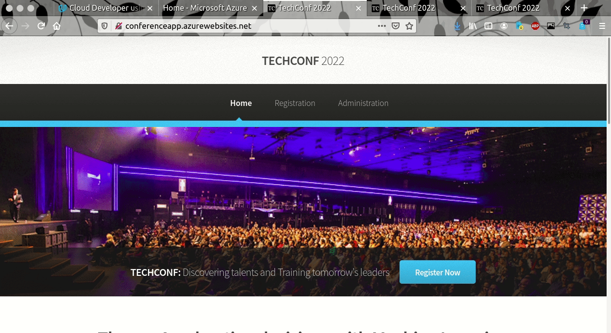
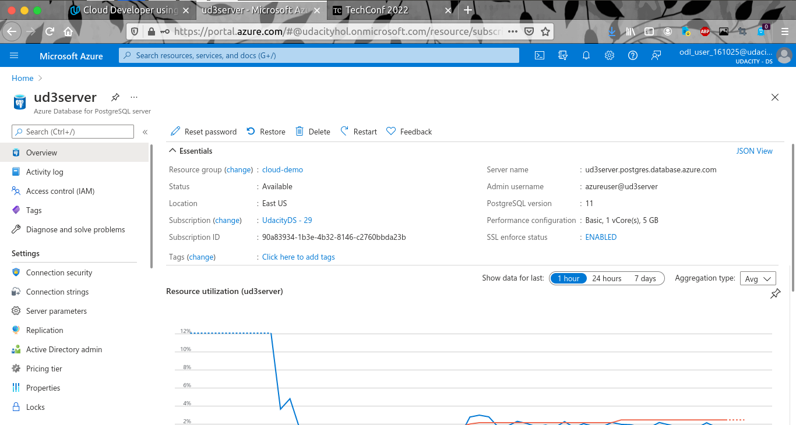
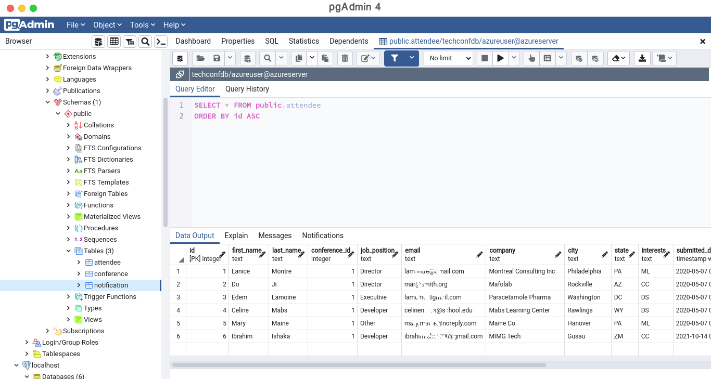
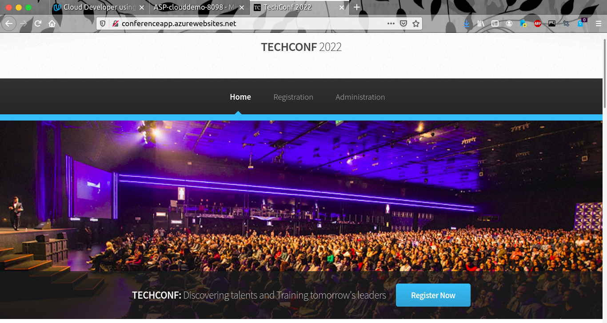
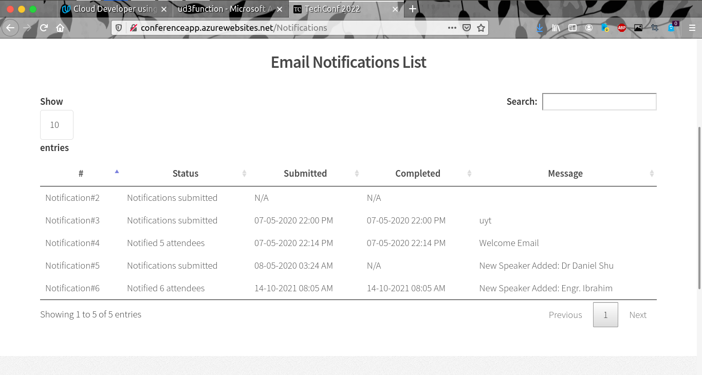
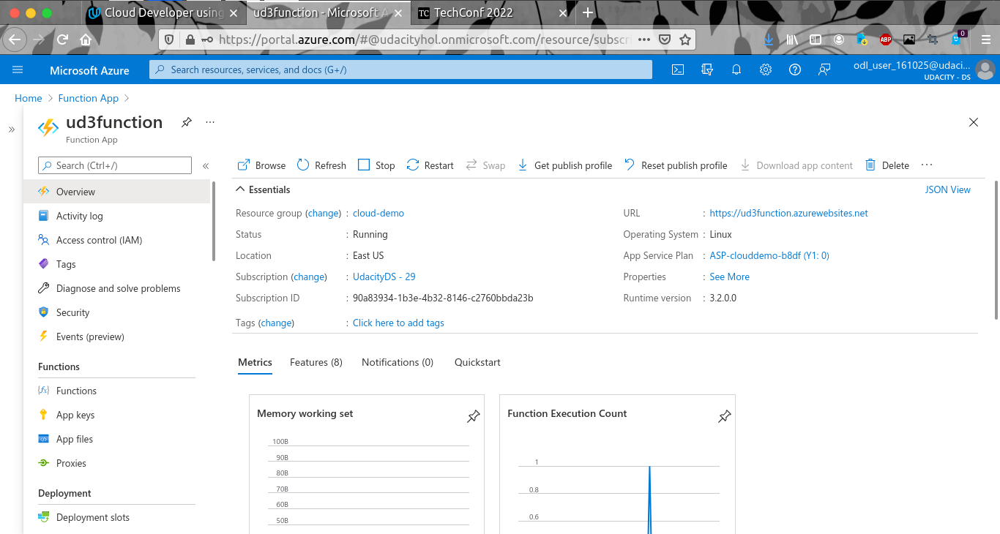
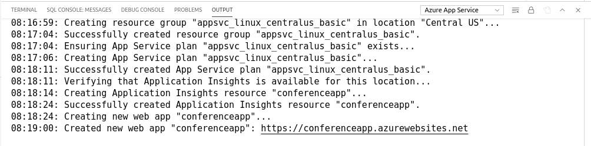
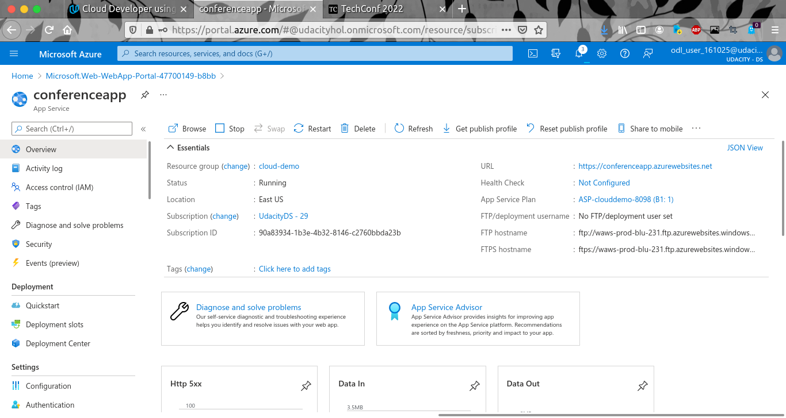

# TechConf Registration Website

## Project Overview
Migrate and deploy a pre-existing web app to an Azure App Service in order to address pain points with its current on-premise deployment.

### Introduction
The TechConf website allows attendees to register for an upcoming conference. Administrators can view the list of attendees and notify all attendees via a personalized email message.

### Problem statement
The application is working but the following pain points have triggered the need for migration to Azure:
 - The web application is not scalable to handle user load at peak
 - When the admin sends out notifications, it's currently taking a long time because it's looping through all attendees, resulting in some HTTP timeout exceptions
 - The current architecture is not cost-effective 

### Solution
Tasks:
- Migrate and deploy the pre-existing web app to an Azure App Service
- Migrate a PostgreSQL database backup to an Azure Postgres database instance
- Refactor the notification logic to an Azure Function via a service bus queue message

## Dependencies

install the following locally:
- [Postgres](https://www.postgresql.org/download/)
- [Visual Studio Code](https://code.visualstudio.com/download)
- [Azure Function tools V3](https://docs.microsoft.com/en-us/azure/azure-functions/functions-run-local?tabs=windows%2Ccsharp%2Cbash#install-the-azure-functions-core-tools)
- [Azure CLI](https://docs.microsoft.com/en-us/cli/azure/install-azure-cli?view=azure-cli-latest)
- [Azure Tools for Visual Studio Code](https://marketplace.visualstudio.com/items?itemName=ms-vscode.vscode-node-azure-pack)

## Project Instructions

### Part 1: Create Azure Resources and Deploy Web App
1. [x] Create a Resource group
2. [x] Create an Azure Postgres Database single server
   

   - Add a new database `techconfdb`
   - Allow all IPs to connect to database server
   - Restore the database with the backup located in the data folder
   

3. [x] Create a Service Bus resource with a `notificationqueue` that will be used to communicate between the web and the function
   - Open the web folder and update the following in the `config.py` file
      - `POSTGRES_URL`
      - `POSTGRES_USER`
      - `POSTGRES_PW`
      - `POSTGRES_DB`
      - `SERVICE_BUS_CONNECTION_STRING`
4. [x] Create App Service plan
5. [x] Create a storage account
6. [x] Deploy the web app

### Part 2: Create and Publish Azure Function
1. [x] Create an Azure Function in the `function` folder that is triggered by the service bus queue created in Part 1.

      **Note**: Skeleton code has been provided in the **README** file located in the `function` folder. You will need to copy/paste this code into the `__init.py__` file in the `function` folder.
      - The Azure Function should do the following:
         - Process the message which is the `notification_id`
         - Query the database using `psycopg2` library for the given notification to retrieve the subject and message
         - Query the database to retrieve a list of attendees (**email** and **first name**)
         - Loop through each attendee and send a personalized subject message
         - After the notification, update the notification status with the total number of attendees notified
         
2. [x] Publish the Azure Function

### Part 3: Refactor `routes.py`
1. [x] Refactor the post logic in `web/app/routes.py -> notification()` using servicebus `queue_client`:
   - The notification method on POST should save the notification object and queue the notification id for the function to pick it up
2. [x] Re-deploy the web app to publish changes

## Monthly Cost Analysis
Complete a month cost analysis of each Azure resource to give an estimate total cost using the table below:

| Azure Resource             | Service Tier    | Monthly Cost |
| -------------------------- | --------------- | ------------ |
| *Azure Postgres Database*  | Basic           | $25.32       |
| *Azure Service Bus*        | Basic           | $0.01        |
| *Azure App service*        | Free (F1)       | $0.00        |
| *Azure Functions*          | Consumption plan| $0.01        |
| *Azure Storage*            | Hot             | $0.06        |

This above cost analysis is based on the current test configuration.

## Architecture Explanation

Microservices are an architectural approach to building applications where each core function, or service, is built and deployed independently.

In this project we used four (4) azure services: Azure web apps, functions, service bus and postgresql database. 
The pre-existing web app is provided, we can quickly deploy and scale it with azure app service.
All the selected services are very cheap, expect postgresql. Azure service bus (Basic tier) cost $0.05 per million operations, almost free for this application!
With Azure function Service Bus Trigger, the way of sending email message is enhanced. The chosen plan for azure function includes a monthly free grant of 1 million requests.

Sending emails now will not affect the app performance because the task has been moved to the background job using azure service bus, the basic tier is enough for this application.
This architecture makes development and scaling of applications easier. 